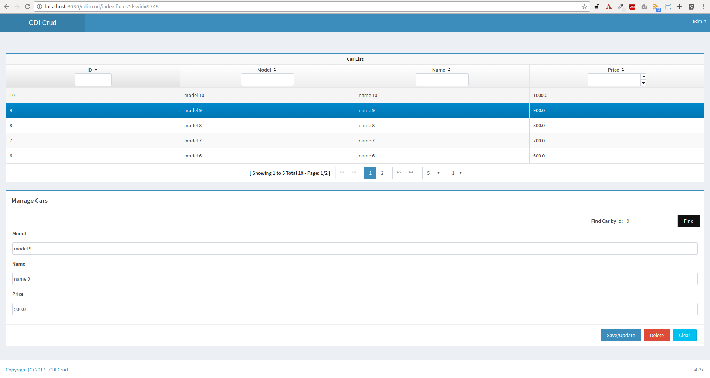

= Simple Java EE CDI Crud example.

image:https://travis-ci.org/rmpestano/cdi-crud.svg[Build Status (Travis CI), link=https://travis-ci.org/rmpestano/cdi-crud]
image:https://coveralls.io/repos/rmpestano/cdi-crud/badge.png[Coverage, link=https://coveralls.io/r/rmpestano/cdi-crud]

== Blog posts
This project is referenced in the following blog posts:

* http://rpestano.wordpress.com/2014/11/04/cdi-crud-multi-tenancy/[CDI crud multi tenancy^];
* http://rpestano.wordpress.com/2014/11/08/arquillian-cucumber-dbunit/[Arquillian, Cucumber and DBunit^];
* http://rpestano.wordpress.com/2014/12/21/some-words-on-javaee-rest-and-swagger/[Some words on JavaEE Rest and Swagger^];
* Its the application deployed in the post https://rpestano.wordpress.com/2015/01/10/a-simple-java-ee-docker-example/[A simple JavaEE Docker Example^];
* https://rpestano.wordpress.com/2015/11/08/test-your-rest-endpoints-inside-the-container-arqtip-1/[Test your REST endpoints inside the container^]
* https://rpestano.wordpress.com/2015/11/12/the-simplest-micro-deployment-arqtip-2/[The simplest micro deployment^]
* https://rpestano.wordpress.com/2017/03/01/smooth-and-powerful-swagger-integration-via-jaxrs-analyzer/[Smooth and powerful Swagger integration via Jaxrs Analyzer^]
* https://rpestano.wordpress.com/2018/06/08/automatic-deployment-arqtip-3/[Arquillian automatic deployment^]
* Torturing Wildflies with Gatling (on going)

== Available at Openshift
You can access the project online at Openshift PaaS:

https://rmpestano.github.io/cdi-crud/

See also https://rmpestano.github.io/cdi-crud/apidocs/index.html[CDI Crud REST API].

== How run it:

The are many ways to run this application:

.Via maven

----
mvn clean package
----
and deploy to a JavaEE server

.Via wildfly-swarm

----
mvn wildfly-swarm:run -Pswarm
----

.Docker

----
docker run -it -p 8080:8080 rmpestano/cdi-crud
----

The application is available at http://localhost:8080/cdi-crud

TIP: execute `build-and-run.sh` to build and run the application on docker. 

== Running tests:

* Via maven:
+
----
mvn clean test -Ptests -Pwildfly-managed
----
* *Or* via IDE: activate container profile in your IDE and Run CrudIt.java|CrudBdd.java|CrudRest|CrudAt as Junit test

== Technologies:

* CDI
* JSF
* Hibernate
* Primefaces/AdminFaces
* Deltaspike
* Arquillian
* Cucumber
* DBUnit
* JaxRS
* Swagger
* Openshift

== Application servers

Tested under:

* Wildfly 8.x
* with minor efforts(mainly persistence configurarion) should run on other *JavaEE 7* application servers

== Forge plugin
if you use http://forge.jboss.org/1.x/[JBoss Forge 1.x] (soon on forge 2) you may have a https://github.com/rmpestano/crud-plugin[look at this plugin] which generates Crud in the format you see at this project.

